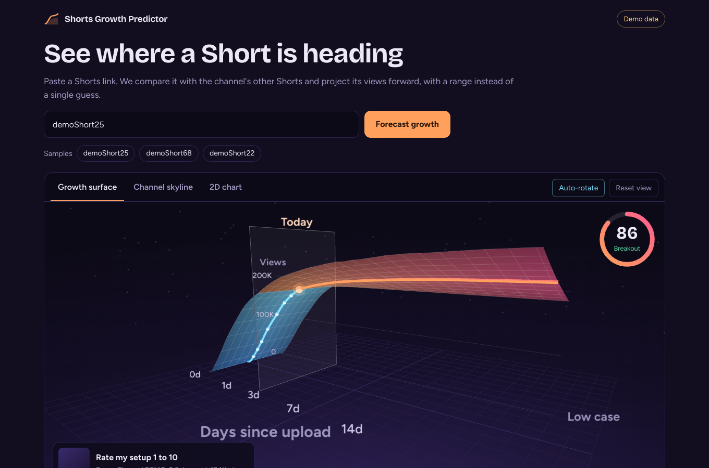
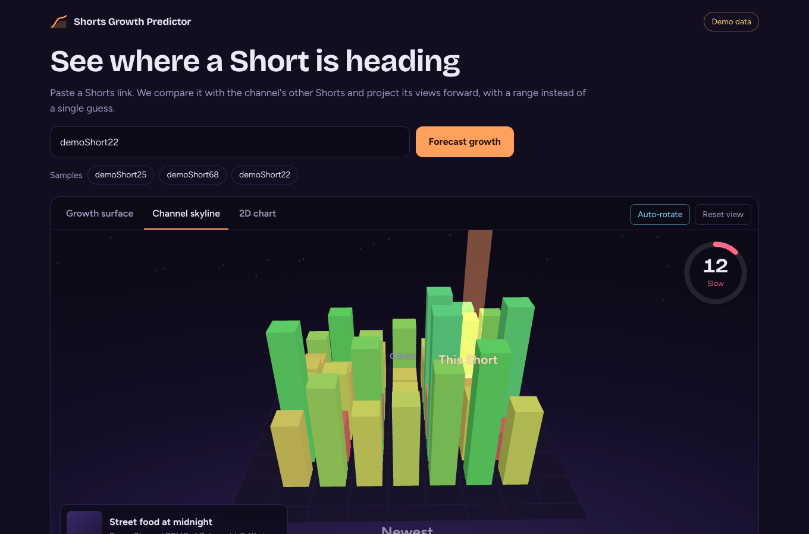
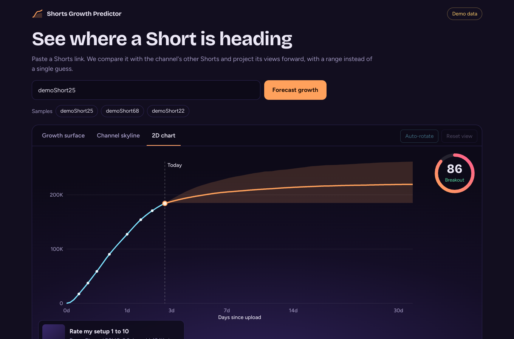
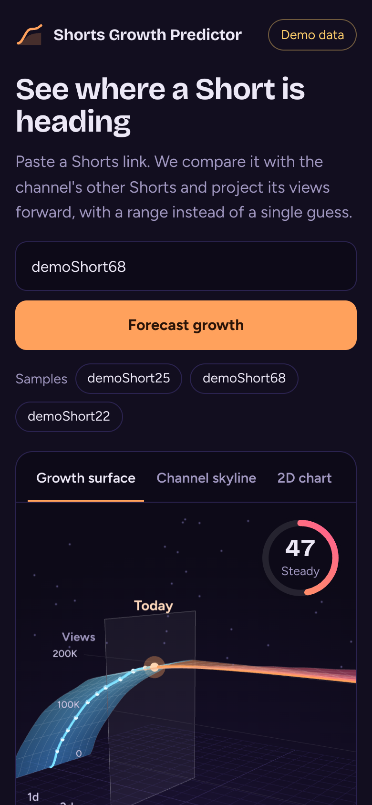
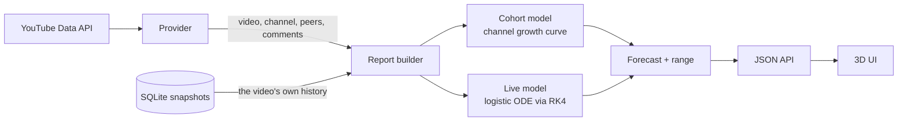

# Shorts Growth Predictor

Paste a YouTube Shorts link and get a forecast of its views, with a range instead of a single guess, shown as an interactive 3D growth surface.



It looks at the Short's views, likes, comments, comment sentiment and the channel's reach, compares the Short with the channel's other recent Shorts, and projects its views forward. It is the evolution of the earlier *Social Media Trend Forecasting using Runge-Kutta 4th Order* project: the RK4 solver is still in there, now inside a real data pipeline.

| Channel skyline | 2D chart | Mobile |
|---|---|---|
|  |  |  |

## Quick start

```bash
python -m venv .venv && source .venv/bin/activate      # Windows: .venv\Scripts\activate
pip install -r requirements.txt
python -m flask --app app:create_app run
```

Open http://127.0.0.1:5000. With no API key it runs in **demo mode** on synthetic data (try `demoShort25`). The badge in the header always says which mode you are in.

### Analyse real Shorts

1. Create a key: Google Cloud Console → enable **YouTube Data API v3** → Credentials → API key.
2. `cp .env.example .env` and set `YOUTUBE_API_KEY=...`
3. Restart. The badge changes to *Live YouTube data*.

One analysis costs about 5 to 8 quota units of the free 10,000 per day, and results are cached for 15 minutes.

## What it does

For a Short, it returns:

- **Forecast**: views after 1, 3, 7, 14, 30 and 90 days, plus lifetime views, each with a likely range (P10 to P90).
- **Milestones**: when it should pass the next round numbers (200K, 500K, 1M...).
- **Signals**: like rate, comment rate, views per hour, views in the last 24 hours (once tracked), views compared with subscribers, and pace against the channel's typical Short of the same age.
- **Comment sentiment** (VADER).
- **Momentum score (0 to 100)**: a descriptive summary of velocity, engagement, reach and sentiment. It does not feed the forecast.
- **Plain-language insights**, including caveats such as hidden likes or too few peers.

The 3D views: a **growth surface** (time × views × low/high case) and a **channel skyline** (every recent Short as a tower, coloured by whether it is ahead of or behind the channel's usual pace). A 2D chart is the accessible fallback and is used automatically when WebGL is unavailable.

## How the forecast works



**Cohort model (always on).** A Short's cumulative views are `V(age) = M · F(age)` where `F` rises from 0 to 1, modelled as a Weibull CDF `F(a) = 1 − exp(−(a/τ)^β)`. The public API only gives *today's* counters, but a channel's recent Shorts have different ages, so together they trace the channel's typical curve. The model fits `log V = log M + log F(age)` across those peers (robust loss, weak prior on `τ, β`). A video at age `a` with `V` views is then projected as `V · F(a′) / F(a)`.

**Uncertainty.** Peers pin down the early curve but barely constrain the tail, so a point estimate would be overconfident. The range comes from a Laplace approximation of the posterior of `(τ, β)` plus per-video deviation from the channel curve. When data are thin the range widens on its own.

**Live model (once history exists).** Every analysis stores a view-count snapshot. With four or more readings spanning at least six hours, a logistic ODE `dV/dt = r·V·(1 − V/K)` is fitted to the video's own trajectory, integrated with the RK4 solver in `app/core/ode.py`, and blended in at 25% weight. `scripts/poll_snapshots.py` collects readings on a schedule.

## Measured accuracy (and its limits)

`python scripts/backtest.py` scores the forecasts against a **synthetic world with known ground truth** (180 videos, ages 0.4 to 14 days):

| Horizon | Median error (cohort only) | Median error (with video history) | P10–P90 coverage |
|---|---|---|---|
| 1 day | 1.2% | 1.8% | ~93% |
| 7 days | 4.0% | 4.4% | ~93% |
| 30 days | 7.0% | 5.9% | ~94% |
| 90 days | 8.1% | 6.1% | ~95% |

Read this carefully:

- It proves the code and the interval logic are correct **on data that follows the model's own assumptions**. It does **not** prove accuracy on real YouTube data, which has surprises the simulation lacks (re-promotion, seasonality, deleted or re-uploaded videos).
- Ranges are nominally 80% but cover about 93% here. That over-coverage is deliberate: the per-video spread is set generously because real-world spread is unknown.
- The way to earn real numbers: run the poller for a few weeks, then compare early forecasts with what actually happened. That backtest on real snapshots is the top item on the roadmap.

## Limitations

- **No public view history.** YouTube exposes daily views only to a channel's owner (YouTube Analytics API, OAuth). For other people's videos this app builds history itself from snapshots.
- **Cross-sectional assumption.** The cohort model assumes the channel's recent Shorts share one level distribution. A channel that grew sharply recently biases the curve shape.
- **Small channels.** With fewer than 8 recent Shorts the confidence is marked *low*; with fewer than 3 the model falls back to a generic Shorts curve.
- **Engagement does not change the numbers.** Likes and comments feed the momentum score and insights, not the forecast, because there is no labelled data yet to learn a reliable link.
- **Live YouTube calls were tested with mocked responses only** (see `tests/test_youtube_provider.py`). Do a smoke test with your own key before relying on it.

## API

| Endpoint | Description |
|---|---|
| `GET /api/analyze?video=<url or id>` | Full report (JSON). Errors: `400 invalid_video`, `404 video_not_found`, `422 cannot_analyze`, `429 rate_limited`, `503 quota_exceeded`, `502 upstream_error` |
| `GET /api/history/<id>` | Stored view-count snapshots for a video |
| `GET /api/health` | Status, mode and version |

Every error is `{"error": {"code": "...", "message": "..."}}`.

## Project layout

```
app/
  core/         ode.py (RK4) · cohort.py (curve fit + uncertainty) · live.py · scoring.py · sentiment.py
  providers/    youtube.py (REST client) · demo.py (synthetic world) · base.py
  services/     report.py (pure analysis) · analyzer.py (cache, limiter, orchestration) · store.py (SQLite)
  static/js/    geometry.js (pure, unit-tested) · scene.js (Three.js) · chart2d.js · main.js
  static/vendor three.js r169 (vendored: no CDN, works offline)
scripts/        backtest.py · poll_snapshots.py
tests/          Python (pytest) and JS (node --test)
```

## Tests

```bash
pip install -r requirements-dev.txt
python -m pytest                       # models, providers, API, storage, calibration
node --test "tests/js/*.test.mjs"      # 3D geometry maths
```

## Deploy

```bash
docker build -t shorts-growth-predictor .
docker run -p 8000:8000 -e YOUTUBE_API_KEY=... -e TRUST_PROXY=1 -v sgp-data:/data shorts-growth-predictor
```

Add a cron job for `python scripts/poll_snapshots.py` every 3 to 6 hours so tracked videos accumulate history. The container runs one gunicorn worker (in-memory cache and rate limiter are per process); scale with threads, or move both to Redis before adding workers.

## Security notes

- The API key stays on the server and is never included in errors or logs.
- Strict Content-Security-Policy (`script-src 'self'`, no inline code); all YouTube-supplied text is inserted with `textContent`.
- Input is validated to an 11-character id; the endpoint is rate limited (30/min per client by default).
- Set `TRUST_PROXY=1` only behind a proxy you control, otherwise clients could spoof their address.

## Roadmap

1. Backtest on real snapshots and recalibrate the interval spread.
2. YouTube Analytics API (OAuth) for creators' own channels: true daily views, retention and traffic sources.
3. Learn an engagement adjustment once enough labelled outcomes exist.
4. Redis for cache and rate limits; scheduled polling built in.

## Credits

Three.js (MIT), Bricolage Grotesque and Figtree (SIL OFL), VADER sentiment (MIT). Licences for vendored assets are next to the files.
